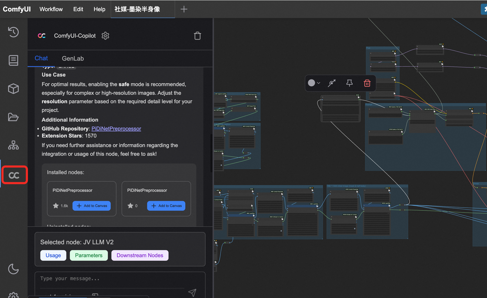
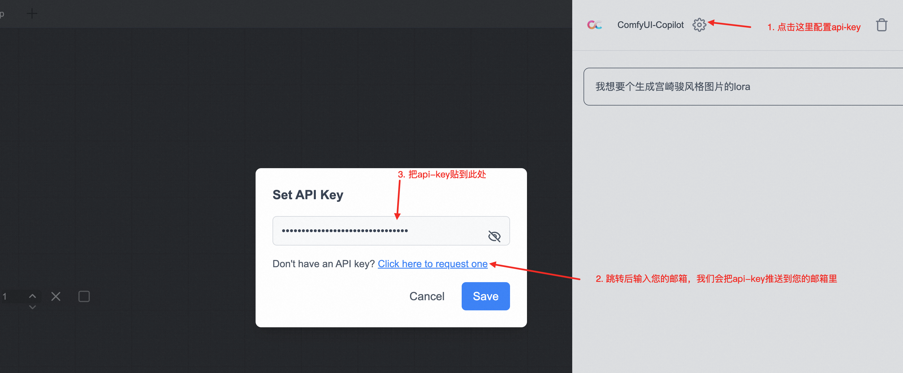

# ComfyUI-Copilot-Ollama 利用ガイド

このドキュメントは、ComfyUI-Copilotのインストールと利用方法、およびOllamaと連携してローカルで大規模言語モデル（LLM）を利用するための環境構築について説明します。

---

## 目次

1.  [**ステップ0：uvのインストール**](#ステップ0uvのインストール)
2.  [**ステップ1：ComfyUIのインストール**](#ステップ1comfyuiのインストール)
    *   [Windowsの場合](#windowsの場合)
    *   [macOSの場合](#macosの場合)
3.  [**ステップ2：ComfyUI-Managerのインストール**](#ステップ2comfyui-managerのインストール)
4.  [**ステップ3：Ollamaのインストールとモデルのセットアップ**](#ステップ3ollamaのインストールとモデルのセットアップ)
    *   [Ollamaのインストール](#ollamaのインストール)
    *   [モデルのダウンロード](#モデルのダウンロード)
5.  [**ステップ4：ComfyUIでOllamaを利用する設定**](#ステップ4comfyuiでollamaを利用する設定)
6.  [**ステップ5：ComfyUI-Copilotのインストール**](#ステップ5comfyui-copilotのインストール)
7.  [**ComfyUI-Copilotの基本的な使い方**](#comfyui-copilotの基本的な使い方)
    *   [起動方法](#起動方法)
    *   [APIキーの設定](#apiキーの設定)
    *   [アップデート](#アップデート)
8.  [**（将来展望）ComfyUI-CopilotとOllamaの連携**](#将来展望comfyui-copilotとollamaの連携)

---

## ステップ0：uvのインストール

`uv`は、Pythonのパッケージ管理と仮想環境構築を高速に行うためのツールです。ComfyUIのセットアップを効率的に行うために、まず`uv`をインストールします。

### Windowsの場合

PowerShellまたはコマンドプロンプトを開き、以下のコマンドを実行します。

```powershell
powershell -ExecutionPolicy ByPass -c "irm https://astral.sh/uv/install.ps1 | iex"
```

### macOSの場合

ターミナルを開き、以下のコマンドを実行します。

```bash
curl -LsSf https://astral.sh/uv/install.sh | sh
```

インストール後、`uv --version`を実行して、バージョン情報が表示されることを確認してください。

---

## ステップ1：ComfyUIのインストール

ComfyUI-Copilotを利用するには、まずお使いのコンピュータにComfyUIがインストールされている必要があります。ここではGPUを使わない（CPUのみ）環境でのインストール方法を説明します。

### Windows & macOS共通

1.  **ComfyUIのリポジトリをクローン:**
    ターミナル（Windowsの場合はコマンドプロンプト）を開き、ComfyUIをインストールしたいディレクトリに移動し、以下のコマンドを実行します。
    ```bash
    git clone https://github.com/comfyanonymous/ComfyUI.git
    cd ComfyUI
    ```

2.  **Python環境のセットアップと依存関係のインストール:**
    `uv`を使用して仮想環境を作成し、必要なライブラリをインストールします。PyTorchのCPU版ナイトリービルドを含みます。
    ```bash
    uv venv
    uv pip install --pre torch torchvision torchaudio --index-url https://download.pytorch.org/whl/nightly/cpu
    uv pip install -r requirements.txt
    ```

3.  **実行:**
    ターミナルで以下のコマンドを実行してComfyUIを起動します。
    ```bash
    uv run python main.py
    ```

---

## ステップ2：ComfyUI-Managerのインストール

ComfyUI-Managerは、カスタムノードやモデルの管理を簡単にするための必須ツールです。

1.  ターミナル（Windowsの場合はコマンドプロンプト）を開きます。
2.  ComfyUIのカスタムノードディレクトリに移動します。
    ```bash
    # ComfyUIをインストールしたディレクトリに移動してから、以下のコマンドを実行
    cd ComfyUI/custom_nodes
    ```
3.  Gitを使用してComfyUI-Managerのリポジトリをクローンします。
    ```bash
    git clone https://github.com/ltdrdata/ComfyUI-Manager.git
    ```
4.  ComfyUIを再起動します。インターフェースに「Manager」というボタンが追加されていれば成功です。

---

## ステップ3：Ollamaのインストールとモデルのセットアップ

Ollamaを使うと、自分のPC上で簡単に大規模言語モデル（LLM）を実行できます。

### Ollamaのインストール

*   **Windows:** [Ollamaの公式サイト](https://ollama.com/download/windows)からインストーラーをダウンロードして実行します。
*   **macOS:** [Ollamaの公式サイト](https://ollama.com/download/mac)からインストーラーをダウンロードして実行します。

インストール後、ターミナルで `ollama --version` コマンドを実行して、バージョン番号が表示されれば成功です。

### モデルのダウンロード

Ollamaで利用するモデルをダウンロードします。ここでは、軽量で高品質な汎用モデルとして**`llava`**と**`stable-diffusion`**を例として使用します。

ターミナルで以下のコマンドをそれぞれ実行してください。モデルのダウンロードが始まります。

*   **Text-to-Image / Image-to-Imageモデル (多機能):**
    ```bash
    ollama pull llava
    ```
*   **高品質なImage-to-Imageモデル:**
    ```bash
    ollama pull stable-diffusion
    ```

---

## ステップ4：ComfyUIでOllamaを利用する設定

ComfyUIからOllamaのモデルを利用するために、専用のカスタムノードをインストールします。

1.  ComfyUIを起動し、**ComfyUI-Manager**を開きます。
2.  「**Install Custom Nodes**」をクリックします。
3.  検索バーに「**Ollama**」と入力します。
4.  検索結果から「**ComfyUI-Ollama**」 by `stavsap` を見つけて「**Install**」ボタンをクリックします。
5.  インストールが完了したら、ComfyUIを再起動します。
6.  ノードを追加する際に、「Ollama」というカテゴリが追加されており、「Ollama Generate」などのノードが利用できれば設定完了です。このノードの`model`入力に、先ほどダウンロードした`llava`などを指定することで、Ollamaのモデルをワークフローに組み込めます。

---

## ステップ5：ComfyUI-Copilotのインストール

準備が整ったので、ComfyUI-Copilotをインストールします。

1.  ComfyUI-Managerを開きます。
2.  「**Install Custom Nodes**」をクリックします。
3.  「**ComfyUI-Copilot**」を検索し、「**Install**」ボタンをクリックします。
4.  インストール後、ComfyUIを再起動してください。

---

## ComfyUI-Copilotの基本的な使い方

### 起動方法

ComfyUIのインターフェースが読み込まれたら、左側のサイドバーにあるCopilotのアイコンをクリックしてサービスを起動します。



### APIキーの設定

ComfyUI-Copilotの全機能を利用するには、APIキーが必要です。

1.  Copilotインターフェース内のキー生成リンクをクリックします。
2.  メールアドレスを入力すると、APIキーがメールで送信されます。
3.  受け取ったAPIキーをCopilotの設定モーダルに入力します。



### アップデート

*   **ComfyUI Manager経由でインストールした場合:** マネージャーの「Update」ボタンを使用します。
*   **手動でインストールした場合:** `ComfyUI-Copilot`ディレクトリに移動し、`git pull`を実行します。

---

## （将来展望）ComfyUI-CopilotとOllamaの連携

現状、ComfyUI-Copilotが直接OllamaのようなローカルLLMを操作する機能は確認されていません。Copilotは主に独自のAIサービスを利用して、ノードの推薦やワークフロー生成のアシストを行います。

しかし、将来的には以下のような連携が期待されます。

*   **ローカルLLMの選択:** Copilotの設定画面で、APIキーの代わりにローカルのOllamaエンドポイントを指定できるようになる。
*   **モデルの自動検出:** CopilotがOllamaにインストールされているモデル（`llava`, `stable-diffusion`など）を自動で検出し、チャット内で利用可能なモデルとして提示する。
*   **オフラインでの利用:** インターネット接続がない環境でも、Ollamaと連携してCopilotの基本的な機能が利用可能になる。

このような機能が実装されれば、ComfyUI-Copilotはより柔軟で強力なアシスタントになるでしょう。今後のアップデートにご期待ください。